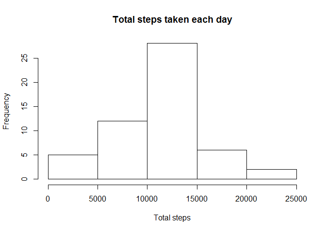
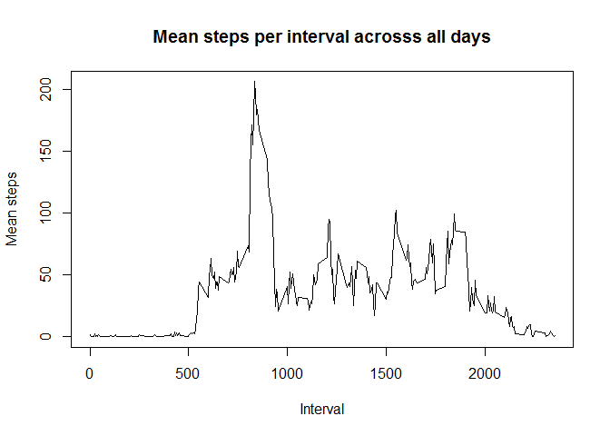
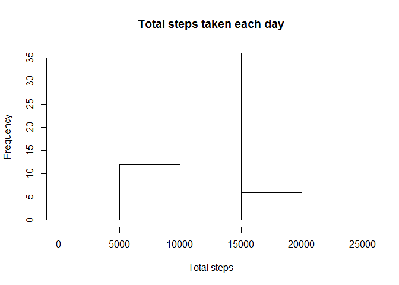
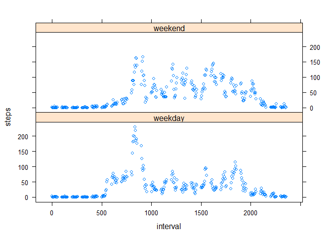

# PA1_template.Rmd
KParley  
17 June 2016  

#KParley Reproducible Research Assignment 1


**Part A; Loading and processing the data**


```r
setwd("~/Work/Professional development/Data Science course/Reproducible Research/RepData_PeerAssessment1")
activity <- read.csv("activity.csv")
activity$date <- as.Date(activity$date, "%Y-%m-%d")
```


**Part B: What is mean total number of steps taken per day?**


This calculates total number of steps per day, then makes a histogram of total number of steps per day and finally calculates and reports mean and median steps per day.


```r
library(plyr)
daytotals <- ddply(na.omit(activity),.(date), summarise, sum = sum(steps))
hist(daytotals$sum, main = "Total steps taken each day", xlab = "Total steps", ylab = "Frequency")
```

<!-- -->

```r
mean(daytotals$sum)
```

```
## [1] 10766.19
```

```r
median(daytotals$sum)
```

```
## [1] 10765
```


**Part C: What is the average daily activity pattern?**


Make a time series plot (i.e. type = "l") of the 5-minute interval (x-axis) and the average number of steps taken, averaged across all days (y-axis)


```r
intervalmean <- ddply(na.omit(activity), ~ interval, summarise, mean = mean(steps))
plot(intervalmean$interval, intervalmean$mean,type = "l", xlab = "Interval", main = "Mean steps per interval acrosss all days", ylab = "Mean steps")
```

<!-- -->


Find the 5-minute interval, on average across all the days in the dataset, which contains the maximum number of steps.


```r
intervalmean[which.max(intervalmean$mean),]
```

```
##     interval     mean
## 104      835 206.1698
```


The interval with the maximum number of steps, on average is 835.


**Part D: Imputing missing values**


calculate and report the total number of missing values in the dataset.


```r
colSums(is.na(activity))
```

```
##    steps     date interval 
##     2304        0        0
```


There are 2304 missing values in the data set, all in the steps variable.


Devise a strategy for filling in all of the missing values in the dataset and create a new dataset that is equal to the original dataset but with the missing data filled in.


The strategy used here is to use the mean of the corresponding interval.


```r
activity2 <- ddply(activity, ~ interval, transform, steps = replace(steps, is.na(steps), mean(steps, na.rm = TRUE)))
activity2 <- activity2[order (activity2$date), ]
```


Make a histogram of the total number of steps taken each day and Calculate and report the mean and median total number of steps taken per day.


```r
daytotals2 <- ddply(activity2, ~ date, summarise, sum = sum(steps))
hist(daytotals2$sum, xlab = "Total steps", main = "Total steps taken each day", ylab = "Frequency")
```

<!-- -->

```r
mean(daytotals2$sum)
```

```
## [1] 10766.19
```

```r
median(daytotals2$sum)
```

```
## [1] 10766.19
```


There is an increase in the number of steps around the mean compared to that calculated prior to imputing and the mean and median are now exactly equal.


**Part E: Are there differences in activity patterns between weekdays and weekends?**


Create a factor variable Create a new factor variable in the dataset with two levels - "weekday" and "weekend" 


```r
activity2$weekday <- factor(weekdays(activity2$date), levels=c('Monday','Tuesday','Wednesday','Thursday','Friday', 'Saturday', 'Sunday'), labels= 1:7)
activity2$weekday <- mapvalues(activity2$weekday, from = 1:7, to = c("weekday", "weekday","weekday","weekday","weekday", "weekend","weekend"))
```


Make a panel plot containing a time series plot of the 5-minute interval (x-axis) and the average number of steps taken, averaged across all weekday days or weekend days (y-axis). 


```r
library(lattice)
activity3 <- aggregate(steps ~ interval + weekday,activity2 , mean)
xyplot(steps ~ interval | weekday, data = activity3, layout = c(1,2))
```

<!-- -->


